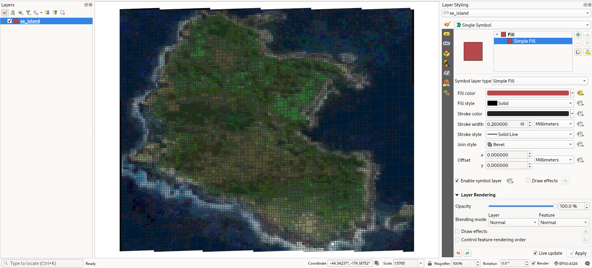

# raster2dggs

[](https://pypi.org/project/raster2dggs/)

Python-based CLI tool to index raster files to DGGS in parallel, writing out to Parquet.

This is the raster equivalent of [vector2dggs](https://github.com/manaakiwhenua/vector2dggs).

Currently this supports the following DGGSs:

- [H3](https://h3geo.org/)
- [rHEALPix](https://datastore.landcareresearch.co.nz/dataset/rhealpix-discrete-global-grid-system)
- [S2](http://s2geometry.io/)
- [A5](https://a5geo.org/)

And these geocode systems:

- [Geohash](https://en.wikipedia.org/wiki/Geohash)
- [Maidenhead Locator System](https://en.wikipedia.org/wiki/Maidenhead_Locator_System)

Contributions (particularly for additional DGGSs), suggestions, bug reports and strongly worded letters are all welcome.


## Installation

`pip install raster2dggs`

## Usage

```
raster2dggs --help

Usage: raster2dggs [OPTIONS] COMMAND [ARGS]...

Options:
  --version  Show the version and exit.
  --help     Show this message and exit.

Commands:
  a5          Index raster data into the A5 DGGS
  geohash     Index raster data into the Geohash DGGS
  h3          Index raster data into the H3 DGGS
  healpix     Index raster data into the HEALPix DGGS
  isea4r      Index raster data into the ISEA4R DGGS
  isea7h      Index raster data into the ISEA7H DGGS
  isea9r      Index raster data into the ISEA9R DGGS
  ivea4r      Index raster data into the IVEA4R DGGS
  ivea7h      Index raster data into the IVEA7H DGGS
  ivea9r      Index raster data into the IVEA9R DGGS
  maidenhead  Index raster data into the Maidenhead DGGS
  rhp         Index raster data into the rHEALPix DGGS
  rtea4r      Index raster data into the RTEA9R DGGS
  rtea7h      Index raster data into the RTEA7H DGGS
  rtea9r      Index raster data into the RTEA9R DGGS
  s2          Index raster data into the S2 DGGS

```

```
raster2dggs h3 --help

Usage: raster2dggs h3 [OPTIONS] RASTER_INPUT OUTPUT_DIRECTORY

  Ingest a raster image and index it to the H3 DGGS.

  RASTER_INPUT is the path to input raster data; prepend with protocol like
  s3:// or hdfs:// for remote data. OUTPUT_DIRECTORY should be a directory,
  not a file, as it will be the write location for an Apache Parquet data
  store, with partitions equivalent to parent cells of target cells at a fixed
  offset. However, this can also be remote (use the appropriate prefix, e.g.
  s3://).

Options:
  -v, --verbosity LVL             Either CRITICAL, ERROR, WARNING, INFO or
                                  DEBUG  [default: INFO]
  -r, --resolution INTEGER RANGE  H3 resolution to index  [0<=x<=15; required]
  -pr, --parent_res INTEGER RANGE
                                  H3 parent resolution to index and aggregate
                                  to. Defaults to max(0, resolution - 6)
                                  [0<=x<=15]
  -b, --band TEXT                 Band(s) to include in the output. Can
                                  specify multiple, e.g. `-b 1 -b 2 -b 4` for
                                  bands 1, 2, and 4 (all unspecified bands are
                                  ignored). If unused, all bands are included
                                  in the output (this is the default
                                  behaviour). Bands can be specified as
                                  numeric indices (1-based indexing) or string
                                  band labels (if present in the input), e.g.
                                  -b B02 -b B07 -b B12.
  -u, --upscale INTEGER           Upscaling factor, used to upsample input
                                  data on the fly; useful when the raster
                                  resolution is lower than the target DGGS
                                  resolution. Default (1) applies no
                                  upscaling. The resampling method controls
                                  interpolation.  [default: 1]
  -c, --compression TEXT          Compression method to use for the output
                                  Parquet files. Options include 'snappy',
                                  'gzip', 'brotli', 'lz4', 'zstd', etc. Use
                                  'none' for no compression.  [default:
                                  snappy]
  -t, --threads INTEGER           Number of threads to use when running in
                                  parallel. The default is determined based
                                  dynamically as the total number of available
                                  cores, minus one.  [default: 19]
  -a, --aggfunc [count|mean|sum|prod|std|var|min|max|median|mode]
                                  Numpy aggregate function to apply when
                                  aggregating cell values after DGGS indexing,
                                  in case of multiple pixels mapping to the
                                  same DGGS cell.  [default: mean]
  -d, --decimals INTEGER          Number of decimal places to round values
                                  when aggregating. Use 0 for integer output.
                                  [default: 1]
  -o, --overwrite
  --warp_mem_limit INTEGER        Input raster may be warped to EPSG:4326 if
                                  it is not already in this CRS. This setting
                                  specifies the warp operation's memory limit
                                  in MB.  [default: 12000]
  --resampling [nearest|bilinear|cubic|cubic_spline|lanczos|average|mode|gauss|max|min|med|q1|q3|sum|rms]
                                  Input raster may be warped to EPSG:4326 if
                                  it is not already in this CRS. Or, if the
                                  upscale parameter is greater than 1, there
                                  is a need to resample. This setting
                                  specifies this resampling algorithm.
                                  [default: average]
  -co, --compact                  Compact the cells up to the parent
                                  resolution. Compaction is not applied for
                                  cells without identical values across all
                                  bands.
  -g, --geo [point|polygon|none]  Write output as a GeoParquet (v1.1.0) with
                                  either point or polygon geometry.  [default:
                                  none]
  --tempdir PATH                  Temporary data is created during the
                                  execution of this program. This parameter
                                  allows you to control where this data will
                                  be written.
  --version                       Show the version and exit.
  --help                          Show this message and exit.
```

## Visualising output

Output is in the Apache Parquet format, hive partitioned with the parent resolution as partition key. The example below is with `-pr 3` with the H3 DGGS.

```bash
tree /home/user/example.pq

/home/user/example.pq
├── h3_03=83bb09fffffffff
│   └── part.0.parquet
└── h3_03=83bb0dfffffffff
    └── part.0.parquet
```

Output can also be written to GeoParquet (v1.1.0) by including the `-g/--geo` parameter, which accepts:
- `polygon` for cells represented as boundary polygons
- `point` for cells represented as centre points
- `none` for standard Parquet output (not GeoParquet) ← this is the default if `-g/--geo` is not used

GeoParquet output is useful if you want to use the spatial representations of the DGGS cells in traditional spatial analysis, or if you merely want to visualise the output.

Below are some ways to read and visualise it.

### DuckDB

```bash
$ duckdb
DuckDB v1.4.1 (Andium) b390a7c376
Enter ".help" for usage hints.
Connected to a transient in-memory database.
Use ".open FILENAME" to reopen on a persistent database.
D INSTALL spatial;
D LOAD spatial;
D SELECT * FROM read_parquet('se_island.pq') LIMIT 7;
┌┌────────┬────────┬────────┬────────────────────────────────────────────────────────────────────────────────┬─────────────┬─────────┐
│ band_1 │ band_2 │ band_3 │                                    geometry                                    │    s2_19    │  s2_08  │
│ float  │ float  │ float  │                                    geometry                                    │   varchar   │ varchar │
├────────┼────────┼────────┼────────────────────────────────────────────────────────────────────────────────┼─────────────┼─────────┤
│    0.0 │    0.0 │    0.0 │ POLYGON ((-176.17946725380486 -44.33542073938414, -176.17946725380486 -44.33…  │ 72b47e01e24 │ 72b47   │
│    0.0 │    0.0 │    0.0 │ POLYGON ((-176.18439390505398 -44.33543749229784, -176.18439390505398 -44.33…  │ 72b47e02a14 │ 72b47   │
│    0.0 │    0.1 │    0.1 │ POLYGON ((-176.18550630891403 -44.33547457195554, -176.18550630891403 -44.33…  │ 72b47e1d54c │ 72b47   │
│    0.0 │    0.0 │    0.0 │ POLYGON ((-176.17819578278952 -44.33537828938332, -176.17819578278952 -44.33…  │ 72b47e01d64 │ 72b47   │
│    0.1 │    0.1 │    0.3 │ POLYGON ((-176.18344039674218 -44.335553297533835, -176.18344039674218 -44.3…  │ 72b47e0282c │ 72b47   │
│    0.0 │    0.0 │    0.0 │ POLYGON ((-176.17899045588274 -44.335404822417665, -176.17899045588274 -44.3…  │ 72b47e01dfc │ 72b47   │
│    0.1 │    0.1 │    0.3 │ POLYGON ((-176.1832814769592 -44.33554799806149, -176.1832814769592 -44.3356…  │ 72b47e02824 │ 72b47   │
└────────┴────────┴────────┴────────────────────────────────────────────────────────────────────────────────┴─────────────┴─────────┘
```

### GDAL

```bash
ogrinfo -so -al ./se_island.pq
INFO: Open of `se_island.pq'
      using driver `Parquet' successful.

Layer name: se_island
Geometry: Polygon
Feature Count: 18390
Extent: (-176.185824, -44.356933) - (-176.159915, -44.335364)
Layer SRS WKT:
GEOGCRS["WGS 84",
    ENSEMBLE["World Geodetic System 1984 ensemble",
        MEMBER["World Geodetic System 1984 (Transit)"],
        MEMBER["World Geodetic System 1984 (G730)"],
        MEMBER["World Geodetic System 1984 (G873)"],
        MEMBER["World Geodetic System 1984 (G1150)"],
        MEMBER["World Geodetic System 1984 (G1674)"],
        MEMBER["World Geodetic System 1984 (G1762)"],
        MEMBER["World Geodetic System 1984 (G2139)"],
        MEMBER["World Geodetic System 1984 (G2296)"],
        ELLIPSOID["WGS 84",6378137,298.257223563,
            LENGTHUNIT["metre",1]],
        ENSEMBLEACCURACY[2.0]],
    PRIMEM["Greenwich",0,
        ANGLEUNIT["degree",0.0174532925199433]],
    CS[ellipsoidal,2],
        AXIS["geodetic latitude (Lat)",north,
            ORDER[1],
            ANGLEUNIT["degree",0.0174532925199433]],
        AXIS["geodetic longitude (Lon)",east,
            ORDER[2],
            ANGLEUNIT["degree",0.0174532925199433]],
    USAGE[
        SCOPE["Horizontal component of 3D system."],
        AREA["World."],
        BBOX[-90,-180,90,180]],
    ID["EPSG",4326]]
Data axis to CRS axis mapping: 2,1
Geometry Column = geometry
band_1: Real(Float32) (0.0)
band_2: Real(Float32) (0.0)
band_3: Real(Float32) (0.0)
s2_19: String (0.0)
s2_08: String (0.0)
```

### QGIS

```bash
qgis sample.pq
```

With some styling applied:



## Installation

PyPi:

```bash
pip install raster2dggs
```

Conda environment:

```yaml
name: raster2dggs
channels:
  - conda-forge
channel_priority: strict
dependencies:
  - python>=3.11,<3.12
  - pip=23.1.*
  - gdal>=3.8.5
  - pyproj=3.6.*
  - pip:
    - raster2dggs>=0.6.0
```

<!-- TODO: package raster2dggs and make available on Conda without pip -->

### For development

In brief, to get started:

- Install [Poetry](https://python-poetry.org/docs/basic-usage/)
- Install [GDAL](https://gdal.org/)
    - If you're on Windows, `pip install gdal` may be necessary before running the subsequent commands.
    - On Linux, install GDAL 3.6+ according to your platform-specific instructions, including development headers, i.e. `libgdal-dev`.
- Create the virtual environment with `poetry init`. This will install necessary dependencies.
- Subsequently, the virtual environment can be re-activated with `poetry env activate`.

If you run `poetry install`, the CLI tool will be aliased so you can simply use `raster2dggs` rather than `poetry run raster2dggs`, which is the alternative if you do not `poetry install`.

#### Code formatting

[](https://github.com/psf/black)

Please run `black .` before committing.

#### Tests

Tests are included. To run them, set up a poetry environment, then follow these instructons:

```bash
cd tests
python ./test_raster2dggs.py
```

Test data are included at `tests/data/`.

#### Experimenting

Two sample files have been uploaded to an S3 bucket with `s3:GetObject` public permission.

- `s3://raster2dggs-test-data/Sen2_Test.tif` (sample Sentinel 2 imagery, 10 bands, rectangular, Int16, LZW compression, ~10x10m pixels, 68.6 MB)
- `s3://raster2dggs-test-data/TestDEM.tif` (sample LiDAR-derived DEM, 1 band, irregular shape with null data, Float32, uncompressed, 10x10m pixels, 183.5 MB)

You may use these for experimentation. However you can also use local files too, which will be faster. A good, small (5 MB) sample image is available [here](https://github.com/mommermi/geotiff_sample).

A small test file is also available at [`tests/data/se-island.tif`] (tests/data/se-island.tif).

## Example commands

```bash
raster2dggs h3 --resolution 11 -d 0 s3://raster2dggs-test-data/Sen2_Test.tif ./tests/data/output/11/Sen2_Test
```

```bash
raster2dggs rhp --resolution 11 -d 0 s3://raster2dggs-test-data/Sen2_Test.tif ./tests/data/output/11/Sen2_Test_rhp
```

```bash
raster2dggs h3 --resolution 13 --compression zstd --resampling nearest -a median -d 1 -u 2 --geo polygon s3://raster2dggs-test-data/TestDEM.tif ./tests/data/output/13/TestDEM
```

## Citation

```bibtex
@software{raster2dggs,
  title={{raster2dggs}},
  author={Ardo, James and Law, Richard and Di Maio, Nicoletta},
  url={https://github.com/manaakiwhenua/raster2dggs},
  version={0.6.0},
  date={2024-06-12}
}
```

APA/Harvard

> Ardo, J., Law, R., & Di Maio, N. (2025). raster2dggs (0.6.0) [Computer software]. https://github.com/manaakiwhenua/raster2dggs

[](https://github.com/manaakiwhenua/manaakiwhenua-standards)
