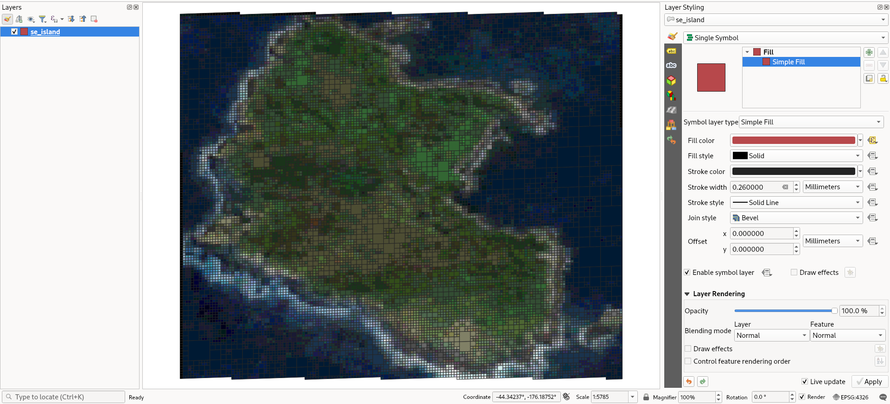

# raster2dggs

[](https://pypi.org/project/raster2dggs/)

Python-based CLI tool to index raster files to DGGS in parallel, writing out to Parquet.

This is the raster equivalent of [vector2dggs](https://github.com/manaakiwhenua/vector2dggs).

Currently this supports the following DGGSs:

- [H3](https://h3geo.org/)
- [rHEALPix](https://datastore.landcareresearch.co.nz/dataset/rhealpix-discrete-global-grid-system)
- [S2](http://s2geometry.io/)
- [A5](https://a5geo.org/)

And these geocode systems:

- [Geohash](https://en.wikipedia.org/wiki/Geohash)
- [Maidenhead Locator System](https://en.wikipedia.org/wiki/Maidenhead_Locator_System)

Contributions (particularly for additional DGGSs), suggestions, bug reports and strongly worded letters are all welcome.


## Installation

This tool makes use of optional extras to allow you to install a limited subset of DGGSs.

If you want all possible:

`pip install raster2dggs[all]`

If you want only a subset, use the pattern `pip install raster2dggs[a5]` (for one) or `pip install raster2dggs[h3,s2,isea4r]` (for multiple).

A bare `pip install raster2dggs` **will not install any DGGS backends**.

## Usage

```
raster2dggs --help

Usage: raster2dggs [OPTIONS] COMMAND [ARGS]...

Options:
  --version  Show the version and exit.
  --help     Show this message and exit.

Commands:
  a5          Index raster data into the A5 DGGS
  geohash     Index raster data into the Geohash DGGS
  h3          Index raster data into the H3 DGGS
  healpix     Index raster data into the HEALPix DGGS
  isea4r      Index raster data into the ISEA4R DGGS
  isea7h      Index raster data into the ISEA7H DGGS
  isea9r      Index raster data into the ISEA9R DGGS
  ivea4r      Index raster data into the IVEA4R DGGS
  ivea7h      Index raster data into the IVEA7H DGGS
  ivea9r      Index raster data into the IVEA9R DGGS
  maidenhead  Index raster data into the Maidenhead DGGS
  rhp         Index raster data into the rHEALPix DGGS
  rtea4r      Index raster data into the RTEA9R DGGS
  rtea7h      Index raster data into the RTEA7H DGGS
  rtea9r      Index raster data into the RTEA9R DGGS
  s2          Index raster data into the S2 DGGS

```

```
raster2dggs h3 --help

Usage: raster2dggs h3 [OPTIONS] RASTER_INPUT OUTPUT_DIRECTORY

  Ingest a raster image and index it to the H3 DGGS.

  RASTER_INPUT is the path to input raster data; prepend with protocol like
  s3:// or hdfs:// for remote data. OUTPUT_DIRECTORY should be a directory,
  not a file, as it will be the write location for an Apache Parquet data
  store, with partitions equivalent to parent cells of target cells at a fixed
  offset. However, this can also be remote (use the appropriate prefix, e.g.
  s3://).

Options:
  -v, --verbosity LVL             Either CRITICAL, ERROR, WARNING, INFO or
                                  DEBUG  [default: INFO]
  -r, --resolution [0-15|smaller-than-pixel|larger-than-pixel|min-diff]
                                  H3 resolution to index. Accepts an integer
                                  in [0, 15] or an auto-detection mode:
                                  'smaller-than-pixel' (first resolution finer
                                  than a pixel), 'larger-than-pixel' (last
                                  resolution coarser than a pixel), or 'min-
                                  diff' (resolution closest to pixel size).
                                  [required]
  -pr, --parent_res INTEGER RANGE
                                  H3 parent resolution to index and aggregate
                                  to. Defaults to max(0, resolution - 6)
                                  [0<=x<=15]
  -b, --band TEXT                 Band(s) to include in the output. Can
                                  specify multiple, e.g. `-b 1 -b 2 -b 4` for
                                  bands 1, 2, and 4 (all unspecified bands are
                                  ignored). If unused, all bands are included
                                  in the output (this is the default
                                  behaviour). Bands can be specified as
                                  numeric indices (1-based indexing) or string
                                  band labels (if present in the input), e.g.
                                  -b B02 -b B07 -b B12.
  --nodata_policy [omit|emit]     'omit' excludes nodata cells from output
                                  (default). 'emit' includes them, writing the
                                  source raster nodata value (or
                                  --emit_nodata_value if set). Note: non-NaN
                                  emitted values participate in cell
                                  aggregation (see -a/--agg); if this is
                                  undesired, ensure your source nodata is NaN
                                  or override with --emit_nodata_value.
                                  [default: omit]
  --emit_nodata_value NUMBER      Override the value written for nodata cells
                                  when --nodata_policy=emit. If omitted, the
                                  source raster nodata value is used (NaN if
                                  none is defined). Pass 'nan' to explicitly
                                  emit NaN. Coerced to the output dtype. Note:
                                  non-NaN values participate in cell
                                  aggregation (see -a/--agg).
  -c, --compression TEXT          Compression method to use for the output
                                  Parquet files. Options include 'snappy',
                                  'gzip', 'brotli', 'lz4', 'zstd', etc. Use
                                  'none' for no compression.  [default:
                                  snappy]
  -t, --threads INTEGER           Number of threads to use when running in
                                  parallel. The default is determined based
                                  dynamically as the total number of available
                                  cores, minus one.
  -a, --agg AGGFUNC[,AGGFUNC...]  Aggregation function(s) applied when
                                  multiple raster pixels map to the same DGGS
                                  cell. Options: count, mean, sum, prod, std,
                                  var, min, max, median, mode, majority,
                                  nunique, range. Comma-separate multiple
                                  names (e.g. min,max) to produce a struct
                                  column per band.  [default: mean]
  --semantics [point_center_strict|point_sample_field|cell_average|piecewise_constant|fraction_cover|count_total|density|event_indicator]
                                  What a raster cell value means (determines
                                  valid transfer operators).  [default:
                                  point_center_strict]
  --transfer [assign_centers|sample_nn|sample_interp|overlay_weighted|overlay_mode|mass_preserve]
                                  How values are mapped from raster pixels to
                                  DGGS cells.  [default: assign_centers]
  --out [value|fractions|histogram|list]
                                  Output schema: scalar value, class
                                  fractions, histogram, or sorted sample list.
                                  'list' collects all contributing pixel
                                  values per cell in ascending order
                                  (deterministic); use -d/--decimals to
                                  control precision.  [default: value]
  -d, --decimals INTEGER|none     Decimal places to round output values. Use 0
                                  for integer output, 'none' to disable
                                  rounding.  [default: 1]
  -o, --overwrite
  -co, --compact                  Compact the cells up to the parent
                                  resolution. Compaction is only applied where
                                  all sibling cells share identical values in
                                  every output column.
  -g, --geo [point|polygon|none]  Write output as a GeoParquet (v1.1.0) with
                                  either point or polygon geometry.  [default:
                                  none]
  --tempdir PATH                  Temporary data is created during the
                                  execution of this program. This parameter
                                  allows you to control where this data will
                                  be written.
  --version                       Show the version and exit.
  --help                          Show this message and exit.
```

## Raster semantics and transfer operators

The conversion from raster to DGGS is not a single operation — it depends on what a raster cell value *means* and how you want values *mapped* to DGGS cells. Three flags control this:

- `--semantics` — what a raster cell value represents
- `--transfer` — the method used to map values from pixels to DGGS cells
- `--out` — the output schema (scalar value, class fractions, histogram, or sorted list)
- `-a`/`--agg` — aggregation function(s) applied when multiple pixels map to the same DGGS cell; comma-separate multiple names (e.g. `--agg min,max`) to produce a struct column per band (`band_1: struct<min: T, max: T>`) instead of a scalar

The defaults (`--semantics point_center_strict --transfer assign_centers --out value`) reflect the historical behaviour of the tool: each pixel centre is indexed to a DGGS cell, and multiple pixels mapping to the same cell are aggregated with the function specified by `--agg`. This produces sparse output (gaps) when the DGGS resolution is finer than the raster.

Support for additional semantics × transfer combinations is being added incrementally. Combinations that are not yet implemented will raise a clear error rather than silently producing incorrect output.

### Semantics (`--semantics`)

| Value | Meaning | Examples |
|---|---|---|
| `point_center_strict` | Value applies **only** at the pixel centre; no implied value elsewhere | Observation grids, sensor samples on a lattice |
| `point_sample_field` | Sample of a continuous field (reconstructable by interpolation) | DEMs (often), modelled temperature/pressure surfaces |
| `cell_average` | Value is the **average over the pixel area** (block support) | Climate "mean over grid cell", averaged concentration grids |
| `piecewise_constant` | Uniform value across the pixel area ("pixel-as-polygon") | Land cover class, soil class, zone IDs, masks |
| `fraction_cover` | Value is a proportion of a class or material within the pixel | % tree cover, % impervious surface, fractional water/snow |
| `count_total` | Value is a total within the pixel (extensive; must conserve sums) | Population count per cell, emissions totals, incident counts |
| `density` | Per-area intensity (intensive quantity) | People/km², biomass density, W/m², rainfall rate |
| `event_indicator` | Presence/absence or event count binned to cells | Fire detected (0/1), lightning presence, event counts |

### Transfer operators (`--transfer`)

| Value | Description |
|---|---|
| `assign_centers` | For each raster pixel, index its **centre coordinate** to a DGGS cell. Produces sparse output (gaps) when the DGGS resolution is finer than the raster. |
| `sample_nn` | For each DGGS cell, sample the raster at the **DGGS cell centre** using nearest-neighbour. |
| `sample_interp` | For each DGGS cell, sample the raster at the DGGS cell centre with interpolation (e.g. bilinear). Suitable for continuous fields. |
| `overlay_weighted` | For each DGGS cell, compute overlap-weighted outputs (means, fractions, histograms). Requires an area model. |
| `overlay_mode` | For each DGGS cell, assign the class with the greatest overlap area. Typically paired with `--valid-coverage-threshold`. |
| `mass_preserve` | Redistribute each raster cell total into DGGS cells proportional to overlap area. Conserves sums. |

### Semantics × transfer compatibility

Legend: **✓** appropriate/common · **△** possible (with caveats) · **✗** inappropriate (breaks semantics) · **—** not yet implemented

> [!NOTE]
> The following table was produced with LLM assistance and may contain errors.

| `--semantics` | `assign_centers` | `sample_nn` | `sample_interp` | `overlay_weighted` | `overlay_mode` | `mass_preserve` | Typical `--out` / `--agg` |
|---|:---:|:---:|:---:|:---:|:---:|:---:|---|
| `point_center_strict` | **✓** | ✗ | ✗ | ✗ | ✗ | ✗ | `value` with `--agg mean\|min\|max\|…`; `--agg min,max` for struct; `--out list\|histogram` |
| `point_sample_field` | △ | **✓** | **✓** | △ | ✗ | ✗ | `value` |
| `cell_average` | ✗ | △ | ✗ | **✓** | ✗ | ✗ | `value --agg mean` |
| `piecewise_constant` | ✗ | △ | ✗ | **✓** | **✓** | ✗ | `value --agg mode` or `fractions` |
| `fraction_cover` | ✗ | △ | △ | **✓** | ✗ | ✗ | `value --agg mean` |
| `count_total` | ✗ | ✗ | ✗ | △ | ✗ | **✓** | `value --agg sum` |
| `density` | ✗ | △ | △ | **✓** | ✗ | △ | `value --agg mean` |
| `event_indicator` | △ | △ | ✗ | △ | △ | **✓** | Presence: `fractions`; Counts: `value --agg sum` |

### Output schemas (`--out`)

| Value | Schema | Description |
|---|---|---|
| `value` | Scalar `T`, or `struct<name: T, …>` with multi-`--agg` | One value per DGGS cell per band (default). Pass a single `--agg` for a scalar; pass comma-separated names (e.g. `--agg min,max`) for a struct. |
| `fractions` | *(not yet implemented)* | Area fractions per class per DGGS cell, for categorical rasters. |
| `histogram` | `struct<values: list<T>, counts: list<int64>>` | Value-count pairs for all contributing pixels, in ascending value order. |
| `list` | `list<T>` | All contributing pixel values in ascending order (deterministic). Useful for `point_center_strict` coarsening workflows. `--agg` has no effect. |

### Currently implemented combinations

| `--semantics` | `--transfer` | `--out` | Notes |
|---|---|---|---|
| `point_center_strict` | `assign_centers` | `value` | Single `--agg` → scalar; multiple `--agg` (e.g. `min,max`) → struct per band. |
| `point_center_strict` | `assign_centers` | `list` | Sorted list of all contributing pixel values per cell. `--agg` is ignored. |
| `point_center_strict` | `assign_centers` | `histogram` | Value-count struct per cell. `--agg` is ignored. |

All other valid combinations will raise a `NotImplementedError` with a descriptive message until they are added.

## Visualising output

Output is in the Apache Parquet format, hive partitioned with the parent resolution as partition key. The example below is with `-pr 3` with the H3 DGGS.

```bash
tree /home/user/example.pq

/home/user/example.pq
├── h3_03=83bb09fffffffff
│   └── part.0.parquet
└── h3_03=83bb0dfffffffff
    └── part.0.parquet
```

Output can also be written to GeoParquet (v1.1.0) by including the `-g/--geo` parameter, which accepts:
- `polygon` for cells represented as boundary polygons
- `point` for cells represented as centre points
- `none` for standard Parquet output (not GeoParquet) ← this is the default if `-g/--geo` is not used

GeoParquet output is useful if you want to use the spatial representations of the DGGS cells in traditional spatial analysis, or if you merely want to visualise the output.

Below are some ways to read and visualise it.

### DuckDB

```bash
$ duckdb
DuckDB v1.4.1 (Andium) b390a7c376
Enter ".help" for usage hints.
Connected to a transient in-memory database.
Use ".open FILENAME" to reopen on a persistent database.
D INSTALL spatial;
D LOAD spatial;
D SELECT * FROM read_parquet('se_island.pq') LIMIT 7;
┌┌────────┬────────┬────────┬────────────────────────────────────────────────────────────────────────────────┬─────────────┬─────────┐
│ band_1 │ band_2 │ band_3 │                                    geometry                                    │    s2_19    │  s2_08  │
│ float  │ float  │ float  │                                    geometry                                    │   varchar   │ varchar │
├────────┼────────┼────────┼────────────────────────────────────────────────────────────────────────────────┼─────────────┼─────────┤
│    0.0 │    0.0 │    0.0 │ POLYGON ((-176.17946725380486 -44.33542073938414, -176.17946725380486 -44.33…  │ 72b47e01e24 │ 72b47   │
│    0.0 │    0.0 │    0.0 │ POLYGON ((-176.18439390505398 -44.33543749229784, -176.18439390505398 -44.33…  │ 72b47e02a14 │ 72b47   │
│    0.0 │    0.1 │    0.1 │ POLYGON ((-176.18550630891403 -44.33547457195554, -176.18550630891403 -44.33…  │ 72b47e1d54c │ 72b47   │
│    0.0 │    0.0 │    0.0 │ POLYGON ((-176.17819578278952 -44.33537828938332, -176.17819578278952 -44.33…  │ 72b47e01d64 │ 72b47   │
│    0.1 │    0.1 │    0.3 │ POLYGON ((-176.18344039674218 -44.335553297533835, -176.18344039674218 -44.3…  │ 72b47e0282c │ 72b47   │
│    0.0 │    0.0 │    0.0 │ POLYGON ((-176.17899045588274 -44.335404822417665, -176.17899045588274 -44.3…  │ 72b47e01dfc │ 72b47   │
│    0.1 │    0.1 │    0.3 │ POLYGON ((-176.1832814769592 -44.33554799806149, -176.1832814769592 -44.3356…  │ 72b47e02824 │ 72b47   │
└────────┴────────┴────────┴────────────────────────────────────────────────────────────────────────────────┴─────────────┴─────────┘
```

Output value columns may also be arrays (`double[]` or `int64[]`) or structs, not just scalar values, depending on the options you pass to the tool (e.g. `--agg min,max` (multiple aggregations) or `--output list|histogram`) and the relative size of the DGGS cells and raster cells.

In the case of struct outputs, it should be noted that there's no real consequence of using a struct (i.e. `band_1.min`, `band_1.max`) over a series of flat columns (i.e. `band_1_min`, `band_1_max`), since Parquet uses Dremel shredding for nested types: a `struct(min double, max double)` column is physically stored as two separate column chunks (`band_1.min`, `band_1.max`) with definition/repetition level metadata. So the on-disk layout is identical to flat columns. Consequences:

- **Compression**: identical. The min values are stored contiguously together, max values together, same as flat columns. Encoding schemes (dictionary, RLE, delta) apply the same way.
- **Column pruning / projection pushdown**: also identical for modern readers. DuckDB's `SELECT band_1.min FROM ...` reads only the min sub-column chunk, same as `SELECT band_1_min FROM ...` would with flat columns.
- **Definition level overhead**: structs add a small amount of metadata to encode nullability at each nesting level. For non-nullable structs with non-nullable fields this is negligible: a few bytes per row group.

Examples:

`--out list -d 1`:

```bash
D SELECT band_1 FROM read_parquet('./tests/data/output/larger-than-pixel/temp_mean_wgs84-poly.geoparquet') LIMIT 7;
┌────────────────────────────────────────────┐
│                   band_1                   │
│                  double[]                  │
├────────────────────────────────────────────┤
│ [15.9, 15.9, 16.1, 16.1, 16.3, 16.3]       │
│ [16.0, 16.0, 16.0, 16.1, 16.1, 16.2, 16.2] │
│ [16.4, 16.6, 16.7, 16.7, 17.0, 17.1]       │
│ [18.0, 18.2, 18.3, 18.4, 18.5]             │
│ [16.4, 16.5, 16.5, 16.6, 16.8, 16.8]       │
│ [17.4, 17.6, 17.7, 17.9, 18.0, 18.2]       │
│ [16.1, 16.2, 16.2, 16.3, 16.4, 16.5]       │
└────────────────────────────────────────────┘
```

`--out histogram -d 0`:

```bash
D SELECT band_1 FROM read_parquet('./tests/data/output/larger-than-pixel/temp_mean_wgs84-poly.geoparquet') LIMIT 7;
┌────────────────────────────────────────────┐
│                   band_1                   │
│ struct("values" bigint[], counts bigint[]) │
├────────────────────────────────────────────┤
│ {'values': [16], 'counts': [6]}            │
│ {'values': [16], 'counts': [7]}            │
│ {'values': [16, 17], 'counts': [1, 5]}     │
│ {'values': [18], 'counts': [5]}            │
│ {'values': [16, 17], 'counts': [2, 4]}     │
│ {'values': [17, 18], 'counts': [1, 5]}     │
│ {'values': [16, 17], 'counts': [5, 1]}     │
└────────────────────────────────────────────┘
```

`--out value --agg min,max,majority,mode -d 0`:

```bash
D SELECT band_1 FROM read_parquet('./tests/data/output/larger-than-pixel/temp_mean_wgs84-poly.geoparquet') LIMIT 7;
┌────────────────────────────────────────────────────────────────┐
│                             band_1                             │
│ struct(min bigint, max bigint, majority bigint, "mode" bigint) │
├────────────────────────────────────────────────────────────────┤
│ {'min': 16, 'max': 16, 'majority': 16, 'mode': 16}             │
│ {'min': 16, 'max': 16, 'majority': 16, 'mode': 16}             │
│ {'min': 16, 'max': 17, 'majority': 17, 'mode': 17}             │
│ {'min': 18, 'max': 18, 'majority': 18, 'mode': 18}             │
│ {'min': 16, 'max': 17, 'majority': 17, 'mode': 17}             │
│ {'min': -9999, 'max': 18, 'majority': 18, 'mode': 18}          │
│ {'min': 16, 'max': 17, 'majority': 16, 'mode': 16}             │
└────────────────────────────────────────────────────────────────┘
```


### GDAL

```bash
ogrinfo -so -al ./se_island.pq
INFO: Open of `se_island.pq'
      using driver `Parquet' successful.

Layer name: se_island
Geometry: Polygon
Feature Count: 18390
Extent: (-176.185824, -44.356933) - (-176.159915, -44.335364)
Layer SRS WKT:
GEOGCRS["WGS 84",
    ENSEMBLE["World Geodetic System 1984 ensemble",
        MEMBER["World Geodetic System 1984 (Transit)"],
        MEMBER["World Geodetic System 1984 (G730)"],
        MEMBER["World Geodetic System 1984 (G873)"],
        MEMBER["World Geodetic System 1984 (G1150)"],
        MEMBER["World Geodetic System 1984 (G1674)"],
        MEMBER["World Geodetic System 1984 (G1762)"],
        MEMBER["World Geodetic System 1984 (G2139)"],
        MEMBER["World Geodetic System 1984 (G2296)"],
        ELLIPSOID["WGS 84",6378137,298.257223563,
            LENGTHUNIT["metre",1]],
        ENSEMBLEACCURACY[2.0]],
    PRIMEM["Greenwich",0,
        ANGLEUNIT["degree",0.0174532925199433]],
    CS[ellipsoidal,2],
        AXIS["geodetic latitude (Lat)",north,
            ORDER[1],
            ANGLEUNIT["degree",0.0174532925199433]],
        AXIS["geodetic longitude (Lon)",east,
            ORDER[2],
            ANGLEUNIT["degree",0.0174532925199433]],
    USAGE[
        SCOPE["Horizontal component of 3D system."],
        AREA["World."],
        BBOX[-90,-180,90,180]],
    ID["EPSG",4326]]
Data axis to CRS axis mapping: 2,1
Geometry Column = geometry
band_1: Real(Float32) (0.0)
band_2: Real(Float32) (0.0)
band_3: Real(Float32) (0.0)
s2_19: String (0.0)
s2_08: String (0.0)
```

### QGIS

```bash
qgis sample.pq
```

With some styling applied:



## Installation

PyPi:

```bash
pip install raster2dggs[all]
```

Conda environment:

```yaml
name: raster2dggs
channels:
  - conda-forge
channel_priority: strict
dependencies:
  - python>=3.11,<3.12
  - pip=23.1.*
  - gdal>=3.8.5
  - pyproj=3.6.*
  - pip:
    - raster2dggs[all]>=0.9.0
```

<!-- TODO: package raster2dggs and make available on Conda without pip -->

### For development

In brief, to get started:

- Install [Poetry](https://python-poetry.org/docs/basic-usage/)
- Install [GDAL](https://gdal.org/)
    - If you're on Windows, `pip install gdal` may be necessary before running the subsequent commands.
    - On Linux, install GDAL 3.6+ according to your platform-specific instructions, including development headers, i.e. `libgdal-dev`.
- Create the virtual environment with `poetry init`. This will install necessary dependencies.
- Subsequently, the virtual environment can be re-activated with `poetry env activate`.

If you run `poetry install -E all --with dev`, the CLI tool will be aliased so you can simply use `raster2dggs` rather than `poetry run raster2dggs`, which is the alternative if you do not `poetry install -E all --with dev`.

For partial backend support you can consider `poetry install --with dev -E h3 -E a5` etc. To check what is installed: `poetry show --tree`.

#### Code formatting

[](https://github.com/psf/black)

Please run `black .` before committing.

#### Tests

Tests are included. To run them, set up a poetry environment, then follow these instructons:

```bash
python tests/test_raster2dggs.py
```

Test data are included at `tests/data/`.

#### Experimenting

Two sample files have been uploaded to an S3 bucket with `s3:GetObject` public permission.

- `s3://raster2dggs-test-data/Sen2_Test.tif` (sample Sentinel 2 imagery, 10 bands, rectangular, Int16, LZW compression, ~10x10m pixels, 68.6 MB)
- `s3://raster2dggs-test-data/TestDEM.tif` (sample LiDAR-derived DEM, 1 band, irregular shape with null data, Float32, uncompressed, 10x10m pixels, 183.5 MB)

You may use these for experimentation. However you can also use local files too, which will be faster. A good, small (5 MB) sample image is available [here](https://github.com/mommermi/geotiff_sample).

A small test file is also available at [`tests/data/se-island.tif`] (tests/data/se-island.tif).

## Example commands

```bash
raster2dggs h3 --resolution 11 -d 0 s3://raster2dggs-test-data/Sen2_Test.tif ./tests/data/output/11/Sen2_Test
```

```bash
raster2dggs rhp --resolution 11 -d 0 s3://raster2dggs-test-data/Sen2_Test.tif ./tests/data/output/11/Sen2_Test_rhp
```

```bash
raster2dggs h3 --resolution 13 --compression zstd -a median -d 1 --geo polygon s3://raster2dggs-test-data/TestDEM.tif ./tests/data/output/13/TestDEM
```

## Citation

Citation metadata is maintained in [`CITATION.cff`](CITATION.cff). GitHub renders this as a **"Cite this repository"** button on the repository page (top-right of the About panel), which provides ready-to-copy BibTeX and APA formats.

[](https://github.com/manaakiwhenua/manaakiwhenua-standards)
